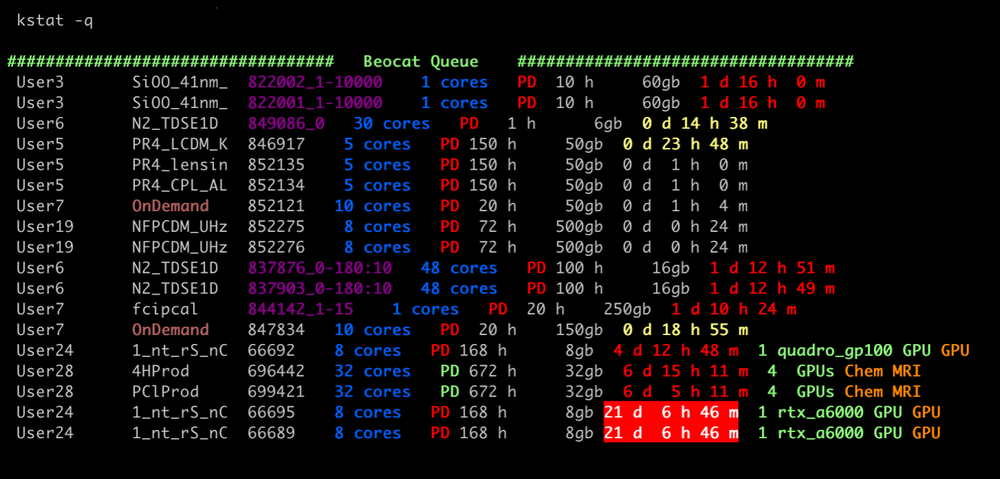

                     kstat - Slurm-based cluster  monitoring tool

__kstat__ is being developed by __Dave Turner__ at __Kansas State University__
Fall 2014 - present  Email: __DaveTurner@ksu.edu__.
This is free software distributed under the GPLv3 license

__kstat.proc.db__ is a Perl script that runs on each compute node collecting data
from Slurm, nvidia-smi, and the /proc file system.  This gets processed and put
into the __PostgreSQL database__ every minute.
Much more info is reported using the '-l' option to kstat.db,
which can for example provide CPU utilization levels (a poor-man's htop).  
kstat.proc.db takes very little CPU time to gather information so it should 
not affect jobs running on the compute nodes.

__kstat.db__ parses information from squeue, sacct, scontrol, and information 
collected in the PostgreSQL database to present it in a more useful and colorful 
manner.  This allows users and admins to monitor scientific applications on 
supercomputers better.  Install and do _kstat --help_ for a more complete listing
of options.

__kstat__ has been heavily developed for the Beocat supercomputer at
Kansas State University and has some internal customizations for this purpose.
Any contributions or bug reports are welcome, but realize that
this software is in the beta stage at this point.

Requirements and Installation
-----------------------------

__kstat__ is a wrapper that loads any modules necessary such as Perl, PostgreSQL, and
optionally gnuplot.  This wrapper then calls __kstat.db__ which is a Perl script that
requires modules Time::Piece and ANSIColor 4 which most Perl versions should now 
include internally, but otherwise you'll need to install them using cpan.
You will need to install the DBI and DBD::Pg Perl modules, and optionally 
Chart::Gnuplot if you want to make graphs instead of just tables.  
All of these should be installed in a local library then the path should be 
exported to _PERL5LIB_ in the __kstat__ wrapper and __kstat.proc.db.sh__ startup script.

<pre>
 cpan Term::ANSIColor          # Should be in Perl by default
 cpan Time::Piece              # Should be in Perl by default
 cpan DBI
 cpan DBD::Pg
 cpan Chart::Gnuplot           # Optional if you want to allow graphs
</pre>

Edit __kstat.config__ to define your setup.  If your system
uses the condo model, you can specify condo partition name and owner name
pairs.
Choose one compute node to act as the __master node__ which will do the
_scontrol show nodes_ on the half minute and put the data into a file for 
all other nodes to read.  If the master node goes down it
only affects some entries when using _kstat --table_ so it isn't a big deal.
You can change the master node in the kstat.config file on the fly.

Set up the PostgreSQL database then initiate it with 
the __kstat_info.qsl__ file with a command like:

<pre>
  psql --dbname=kstat_info --host=dbhost.name.edu --port=5432 --username=kstat --file=kstat_info.sql
</pre>

The __kstat.init.db__ script can be used to clean all tables or just jobs.  In general
this will not be needed.

Use __systemctl__ to so the __kstat.proc.db.sh__ script auto starts on on each compute 
node on boot and if it dies.  This runs the kstat.proc.db Perl script which populates 
the PostgreSQL database every minute.  You will need to edit this script to
load the appropriate PostgreSQL and Perl modules.

kstat usage
-----------

kstat.db --help
<pre>
------------
USAGE: kstat [-q] [-c] [-g] [-l] [-u user] [-p NaMD] [-j 1234567] [--part partition]
       kstat alone dumps all info except for the core summaries
       choose -q -c for only specific info on queued or core summaries.
       then specify any searchables for the user, program name, or job id

kstat                 info on running and queued jobs
kstat -h              list host info only, no jobs
kstat -q              info on the queued jobs only
kstat -c              core usage for each user
kstat -d #            show jobs run in the last # days
                      Memory per node - used/allocated/requested
                      Red is close to or over requested amount
                      Yellow is under utilized for large jobs
kstat -h -l -g all    Show all GPU nodes
kstat -h -l -g a4000  Show 1 particular type of GPU node
kstat -h -l -g 20gb   Show GPU nodes over min memory in gb
kstat -o Turner       Only show info for a given owner
kstat -o CS_HPC          Same but sub _ for spaces
kstat -l              long list - node features and performance
                      Node hardware and node CPU usage
                      job nodelist and switchlist
                      job current and max memory
                      job CPU utilizations
kstat -u daveturner   job info for one user only
kstat --me            job info for my jobs only
kstat -j 1234567      info on a given job id
kstat --osg           show OSG background jobs also
kstat --nocolor       do not use any color
kstat --name          display full names instead of eIDs

---------------- Graphs and Tables ---------------------------------------
Specify graph/table,  CPU or GPU or host, usage or memory, and optional time
kstat --graph-cpu-memory #      gnuplot CPU memory for job #
kstat --table-gpu-usage-5min #  GPU usage table every 5 min for job #
kstat --table-cpu-60min #       CPU usage, memory, swap table every 60 min for job #
kstat --table-node [nodename]   cores, load, CPU usage, memory table for a node

--------------------------------------------------------------------------
  Multi-node jobs are highlighted in Magenta
     kstat -l also provides a node list and switch list
     highlighted in Yellow when nodes are spread across multiple switches
  Run time is colorized yellow then red for jobs nearing their time limit
  Queue time is colorized yellow then red for jobs waiting longer times
--------------------------------------------------------------------------
</pre>

Example Output
--------------

The figure below shows the output to __kstat -h__ which contains the host
information only without any job information.  The Beocat cluster at Kansas 
State Uniiversity has around 310 compute nodes so I editted the output for
brevity.
Our compute nodes vary with each purchase, so we name each type differently.

The first column is the name of the compute node, the second
shows the number of cores used and total, with colorization to show if the
cores are unused/partially used/totally full.  The number of GPUs are also
shown in green.  The current load is next which may be colorized yellow or
red if less than or greater than the cores used count.  The next column
lists the actual memory used, the memory allocated by Slurm, and the total
memory on the compute node, all in GB.  This same column may contain 
warning or error messages if the compute node is down or draining.
The last column can list the individual or group that owns that compute
node (condo owner) meaning that users in that group will have kill 
priority when they run.

To give some example, Hero35-36 are owned by the CS HPC group (our admins).
Dwarf38 has 12 of 32 cores being used with a load of 12, 102 GB memory used
with 496 GB of 502 GB allocated by Slurm, and it has the GPU priority group
which we can assign users into.
The Gremlins are our interactive nodes supporting OpenOnDemand.
The Wizards are our newest Intel systems with 32-40 cores, some having GPUs,
and are owned by different groups around campus including BioInfo
and Chem MRI.
The Warlocks are our newest AMD systems, with these having 4 GPUs each.
Three of these compute nodes are down at the moment, and kstat picks up
the reason that our admins entered through Slurm.

  

__kstat__ with no arguments produces a complete list of hosts, jobs on each host,
and jobs in the queue.  The example below was run with the _--nonames__
option to replace the actual usernames with _user#_ and the compute node
list was shortened.  This also omitted the queued jobs.

All jobs on Dwarf38 are showing the memory usage in background yellow indicating
that all requested way more memory than they are using.  Memory in red indicates
jobs at or near their memory request, and any that went over are marked as
disk spapping.

The first job on Dwarf38 and both on Hero19 show the job name in magenta
indicating they are multi-node jobs.  The other jobs on Dwarf38 show a job
ID number in purple indicating they are array jobs.
The first 2 jobs on Dwarf39 show they are running on 1 core 1 GPU.
Jobs where the work _run_ is in green are running with full priority and
cannot be pre-empted, while those _run_ in red means those jobs are killable
if jobs come along with priority for those owned nodes in a condo environment.

Wizard34 is showing 12 of 40 cores in use, but a load of only 1 indicating
the job is not using the 12 cores requested.

kstat provides all this information to the users as well as the HPC administrators
so that they can more easily understand when they are not running optimally
and either adjust their usage or ask for help.

  

__kstat -l__ provides a long list of information about each compute node and
each job.  The figure below is for Wizard35 and shows the local disk size of
1.9 TB, network of 40 Gbps RoCE, 4 GPUs with the type _geforce_rtx_2080_ti_
which would be the descriptor used to request that particular type if needed,
and the GPU memory of 11.264 GB.  The CPU usage for the node is also provided
which is updated every minute.

Each job also has added information.  The 32 core 4 GPU job of User35 shows
4.361 GB current memory with about the same for the max memory.  Having this
readily available to users makes it much easier for them to request the 
proper amount of memory for each job.
The CPU usage for that job is also given below to allow the user to know
when their job is not running efficiently.
The GPU utilization and GPU memory usage are also readily available.
All this data is stored every minute and kstat can present it in either
table or graph form.

  

__kstat -q__ shows the jobs in the queue waiting to be scheduled. 
The user names have been sanitized using the --nonames flag.
Herre User3 is running several array jobs where the job ID and task range
are marked in purple.
User7 has submitted an OnDemand job from our web interface which has been waiting
for an hour.
User24 has some jobs that have been in the queue for a long time since they 
are trying to run on a specific type of GPUs with large memory and they
do not have priority on the few we have.
User28 has 2 jobs requesting 4 GPUs on the same node and has been waiting
for a week even though they have priority on the Chem MRI nodes.  They
are probably waiting for some of their own jobs to finish before these can
run.

  

__kstat -j #__ can be used to get a very complete view of a job including all
information that sacct provides colorized for easy reading.  This will also 
dump the job submission script for the user or an admin that has read permissions
for user accounts allowing them to fully see what the job is trying to do.

  

__kstat -c__ can be used to get a complete listing of the cores used and
queued by each user.  Heavy users are colorized by yellow for above 5%
usage and red for above 10%.  Usernames have been sanitized for this figure.
The grayed out User40 is Open Science Grid jobs.

  

__kstat --table-node all__ will provide a summary of the total nodes, cores,
GPUs, and memory on the entire cluster followed by the daily usages for 
all days in stored in the database.  You can also generate tables of CPU
usage and memory or GPU usage and memory for a specific job.

  

__kstat --graph-gpu-usage #__ can provide the GPU or CPU usage or memory
in a graph if you have gnuplot installed and used ssh -X to log into
your head node.

  

Known Issues
------------

kstat.proc.db has only been tested on Rocky and CentOS Linux.
Paths may need to be adjusted for other Linux flavors.

This code is only being used on a few HPC systems at this time.
If you want to try it out, please provide feedback on the installation
process.  Also feel free to contact the author if any help is needed.

Future work
-----------

Notes
-----

  [PEARC'19 paper](./papers/Pearc-2019.pdf) mentioning kstat at the end

This README.md file is from https://gitlab.beocat.ksu.edu/Admin-Public/kstat.git

